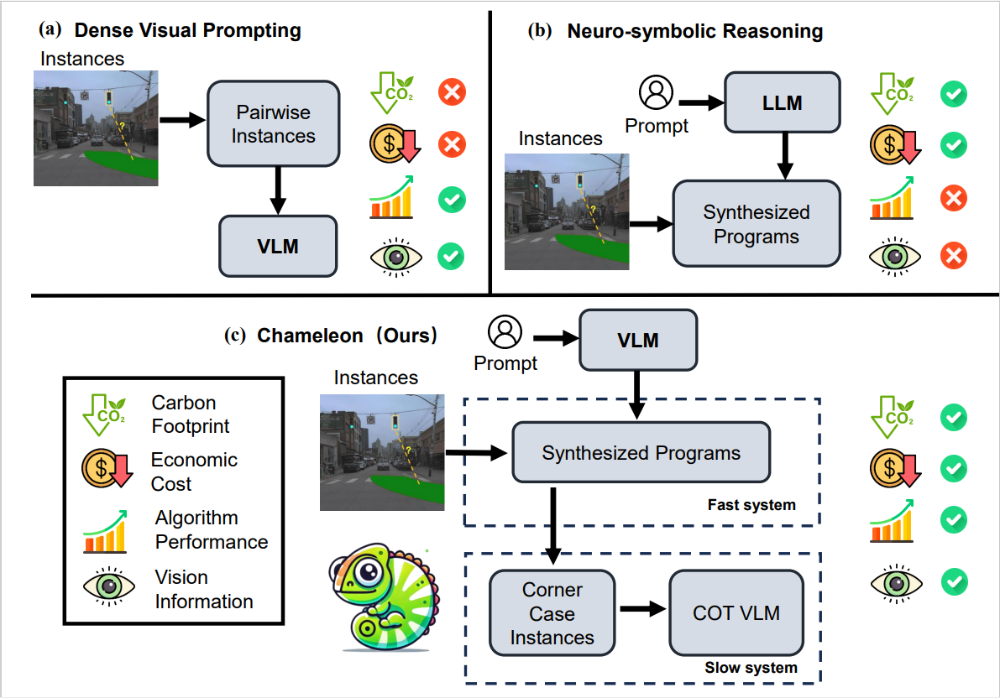
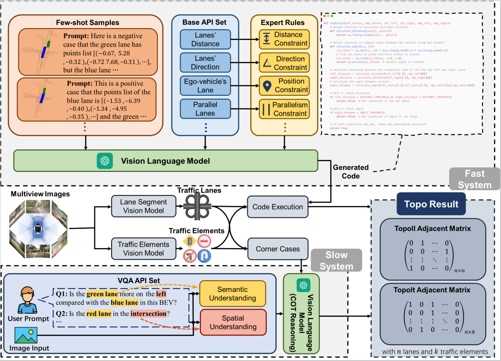

<h2>🦎Chameleon: Fast-slow Neuro-symbolic Lane Topology Extraction</h2>

**Zongzheng Zhang**1,2* · **Xinrun Li**2* · **Sizhe Zou**1 · **Guoxuan Chi**1 · **Siqi Li**1  
**Xuchong Qiu**2 · **Guoliang Wang**1 · **Guantian Zheng**1 · **Leichen Wang**2 · [**Hang Zhao**](https://hangzhaomit.github.io/)3 and [**Hao Zhao**](https://sites.google.com/view/fromandto/)1

1Institute for AI Industry Research (AIR), Tsinghua University · 2Bosch Corporate Research  
3Institute for Interdisciplinary Information Sciences (IIIS), Tsinghua University  
(* indicates equal contribution)

<!-- > **ICRA 2025** -->

<!-- >
[\[Arxiv\]](https://arxiv.org/abs/2401.06614) [\[Paper\]](https://arxiv.org/pdf/2401.06614.pdf) [\[Project Page\]](https://vveicao.github.io/projects/Motion2VecSets/) [\[Video\]](https://www.youtube.com/watch?v=VXI3y2o0SqY&ab_channel=MatthiasNiessner)
-->

    Lane topology extraction involves detecting lanes and traffic elements and determining their relationships, a key perception task for mapless autonomous driving. This task requires complex reasoning, such as determining whether it is possible to turn left into a specific lane. To address this challenge, we introduce neuro-symbolic methods powered by visionlanguage foundation models (VLMs).

 We propose a fast-slow neuro-symbolic lane topology extraction algorithm, named Chameleon, which alternates between a fast system that directly reasons over detected instances using synthesized programs and a slow system that utilizes a VLM with a chain-of-thought design to handle corner cases. Chameleon leverages the strengths of both approaches, providing an affordable solution while maintaining high performance. We evaluate the method on the OpenLane-V2 dataset, showing consistent improvements across various baseline detectors.

<!-- > https://github.com/OpenDriveLab/DriveLM/assets/103363891/67495435-4a32-4614-8d83-71b5c8b66443 -->

<!-- > above is old demo video. demo scene token: cc8c0bf57f984915a77078b10eb33198 -->

https://github.com/user-attachments/assets/dddde21a-5ce3-4324-8fef-e3eb531a40d0

<!-- > above is new demo video. demo scene token: cc8c0bf57f984915a77078b10eb33198 -->

## Detailed Docs

[Vector VQA task](./docs/VQA.md)

## 📌 TODO List
- [x] Project Page Setup 
- [x] vec VQA task test & Evaluation
- [ ] other VQA tasks & Evaluation
- [ ] Example Data
- [ ] Environment Preparation
- [ ] Code Generation Tutorial
- [ ] Full Test Tutorial
- [ ] ...

