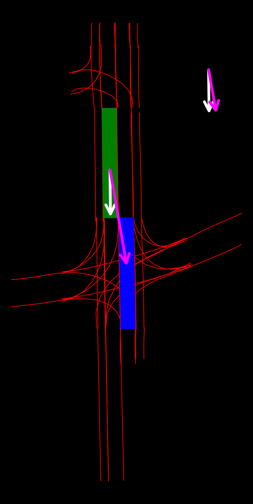

## Data preparation

<!-- [Google Drive](https://drive.google.com/file/d/10FUIrxqSPai6eQlqlgIkmBjvtBAyCmJT/view?usp=drive_link) -->
Before the data generation, you can directly get the lane segment and traffic element perception results of TopoMLP from the [Git Release](https://github.com/XR-Lee/neural-symbolic/releases/download/data-samples/results_base.7z). You can download and extract the pickle file and save it in `./dataset/`.

You can run the following command to convert the pickle file into timestamp-wise json files:

```python
# Convert pkl to json
python tools/pkl2json.py --input $PKL_PATH --output $OUTPUT_PATH --verbose

# For example, you can try this
python tools/pkl2json.py --input ./dataset/results_base.pkl --output ./dataset/output_json --verbose
```

### Generate Images for vector VQA task

Then you can generate the corresponding visual prompt data for different VQA sub-tasks. And you can find data generation scripts in `./data/VQA/{sub-task}/`.


For vector task, you should generate BEV images only:
```python
# Generate BEV images for the connection VQA task
# check the path in the scripts before run it
python ./VQA/vector/data/pairwise_vec_BEV.py
```


Through the command, you can obtain visual prompts like as follows:
<div style="text-align: center;">
    
</div>

 


## Testing and evaluation

You can run the VQA task with the following command, here we use the connection VQA task as an example. 

```python
# Run the connection VQA task using GPT-4o
python ./VQA/vector/vec_VQA.py
```

You should get a result file after this finished in  `./dataset/VQA/topll_vec_result_gpt4o.txt` 


For evaluation, you can run the following command:

```python
# Evaluate your prediction
python ./VQA/vector/evaluate_vec.py
```


## Other VQA tasks

To be Continued