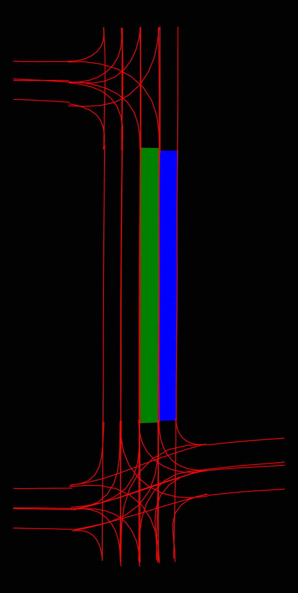

## Data preparation

Before the data generation, you can directly get the lane segment and traffic element perception results of TopoMLP from the [Google Drive](https://drive.google.com/file/d/10FUIrxqSPai6eQlqlgIkmBjvtBAyCmJT/view?usp=drive_link). You can download the pickle file and save it in `/dataset`.

You can run the following command to convert the pickle file into timestamp-wise json files:

```python
# Convert pkl to json
python tools/pkl2json.py --input $PKL_PATH --output $OUTPUT_PATH --verbose

# For example, you can try this
python tools/pkl2json.py --input ./dataset/results_base.pkl --output ./dataset/output_json --verbose
```

Then you can generate the corresponding visual prompt data for different VQA sub-tasks. And you can find data generation scripts in `/VQA/sub-task/data`. For intersection task, you should generate BEV images and PV images respectively, and then make mosaics of them. Here, we take the connection VQA task for instance:

```python
# Generate BEV images for the connection VQA task
python ./VQA/connection/data/pairwise_conn_BEV.py --output $GENERATION_PATH --verbose
```

Through the command, you can obtain visual prompts like as follows:
<div style="text-align: center;">
    
</div>


On top of that, you should make your text prompts for the VQA task and save it as a `txt` file. For instance:

```python
system_context = '''
The red lines in the photos are lane boundaries. Two segments in different lanes don't have any connection relationship. Only two segments in the same lane end to end adjacent are considered as directly connected.
'''
prompt = '''
You are an expert in determining adjacent lane segments in the image. Let's determine if the the green segment is directly connected with the blue segmemt. Please reply in a brief sentence starting with "Yes" or "No".
'''
```

So far, you get done all preparations for an VQA task.

## Testing and evaluation

You can run the VQA task with the following command, here we use the connection VQA task as an example. 

```python
# Run the connection VQA task
python ./VQA/connection/conn_VQA.py --txt $TEXT_PROMPT_PATH --visual $VISUAL_PROMPT_PATH --output $OUTPUT_RESULT_PATH --key $OPENAI_API_KEY --verbose
```

For evaluation, you can run the following command:
```python
# Evaluate your prediction
python ./VQA/connection/evaluate_conn.py --path $RESULT_PATH
```